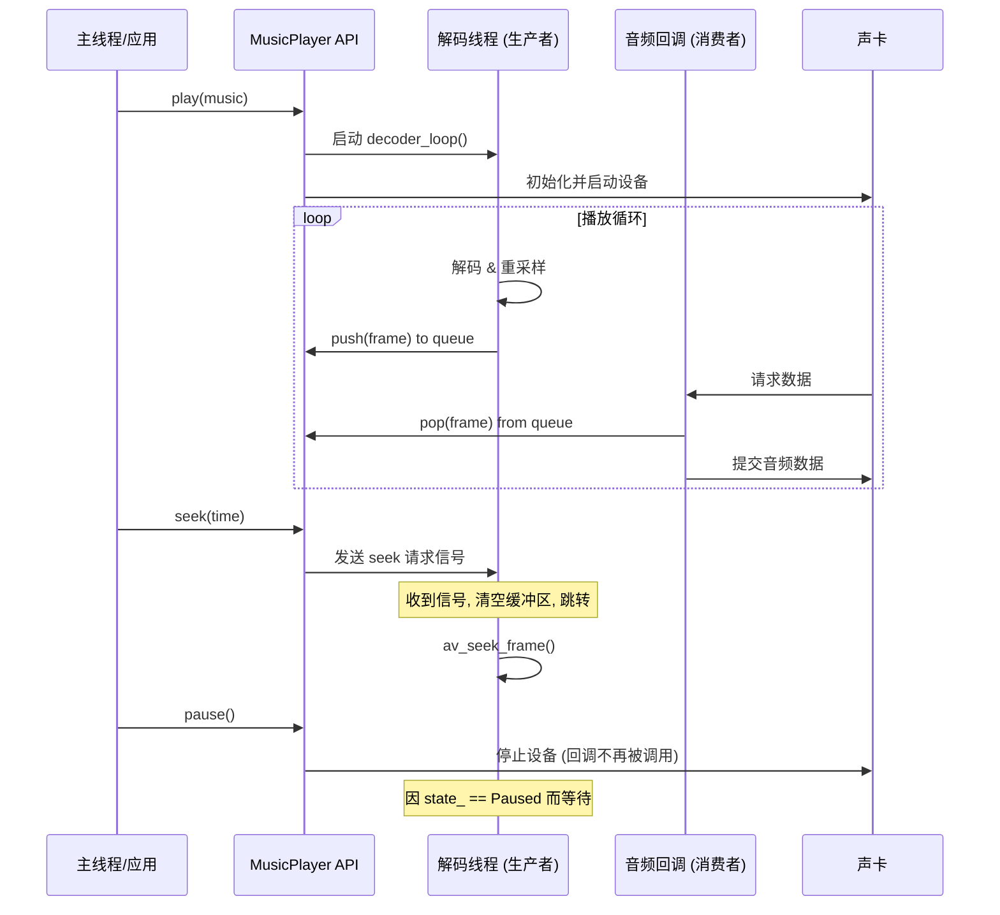

### `MusicPlayer` 内部工作逻辑

#### 1. 生产者-消费者模型

为了实现流畅、无卡顿的音乐播放，`MusicPlayer` 的核心架构基于经典的**“生产者-消费者 (Producer-Consumer)”**设计模式。该模式将耗时的操作（文件读取与音频解码）与需要严格实时性的操作（将音频数据提交给硬件）分离开来，在不同的线程中执行。

整个逻辑的目标是：

- **异步解码**：在一个独立的后台线程（“生产者”）中完成所有文件I/O和解码工作，避免阻塞主线程或UI线程。
- **实时音频输出**：在由音频设备驱动的高优先级回调线程（“消费者”）中，只执行最简单的内存拷贝操作，确保音频数据能被准时送达硬件，防止爆音和卡顿。
- **缓冲队列**：在生产者和消费者之间建立一个线程安全的缓冲队列（`frame_queue_`），用于平滑解码速度的波动，保证消费者总是有数据可取。
- **精确的状态控制**：通过互斥锁和条件变量，实现播放、暂停、停止和跳转（Seek）等功能的精确线程同步。

这个流程主要分为三个核心阶段：播放初始化、解码与缓冲核心循环、状态控制与线程同步。

#### 2. 阶段一：播放初始化 (`play()` 方法)

这是所有播放任务的起点，当应用调用 `MusicPlayer::play(music)` 时触发。

1. **清理旧状态**：首先会调用 `stop()` 来确保任何上一个播放任务都已完全停止并清理了所有资源。
2. **FFmpeg初始化**：
   - 打开传入的音乐文件 (`avformat_open_input`)。
   - 查找并分析音频流信息 (`avformat_find_stream_info`)。
   - 根据音频流找到最合适的解码器 (`avcodec_find_decoder`) 并创建解码器上下文。
3. **重采样器初始化**：创建并配置 `SwrContext`。`MusicPlayer` 会将所有不同格式的原始音频数据（如 `s16`, `s32p`）统一重采样为播放设备（miniaudio）原生支持的格式（32位浮点立体声 `f32`），极大地简化了后续处理。
4. **音频设备初始化**：
   - 初始化 `miniaudio` 设备 (`ma_device_init`)。
   - 将核心的音频回调函数 (`audio_callback_wrapper`) 注册给 `miniaudio`。这个回调函数就是“消费者”的入口。
   - 启动音频设备 (`ma_device_start`)，此时设备会开始周期性地调用回调函数索取音频数据。
5. **启动解码线程**：所有初始化都成功后，创建一个新的 `std::thread` 来运行 `decoder_loop()` 函数。这个线程就是“生产者”，它的生命周期将与本次播放任务绑定。

#### 3. 阶段二：解码与缓冲核心循环

播放开始后，播放器的主要工作由两个并行的循环驱动：

##### a) 生产者：`decoder_loop()` 线程

这个函数在一个独立的后台线程中不知疲倦地工作，它的任务是生产 `AudioFrame` 对象：

1. **读取数据包**：从文件中读取一个压缩的音频包 (`AVPacket`)。
2. **解码**：将 `AVPacket` 发送给FFmpeg解码器，并接收解码后的原始音频帧 (`AVFrame`)。
3. **重采样**：将解码后的 `AVFrame` 通过 `SwrContext` 转换为我们统一的目标格式（f32立体声）。
4. **放入队列**：将转换后的音频数据封装在一个 `AudioFrame` 对象中，然后加锁，将其推入 `frame_queue_` 的末尾。
5. **背压控制**：在生产前，会检查队列大小。如果队列已满（`> MAX_QUEUE_SIZE`），则会在此处等待，直到消费者取走一些数据后再继续生产，防止内存无限制增长。

##### b) 消费者：`process_playback_frames()` 音频回调

这个函数由 `miniaudio` 在一个高优先级的实时线程中调用，它的任务是消费 `AudioFrame` 对象：

1. **被动触发**：当声卡需要更多数据时，此函数被自动调用。
2. **检查队列**：加锁访问 `frame_queue_`，检查是否有可用的 `AudioFrame`。
3. **数据拷贝**：如果队列中有数据，就从队首的 `AudioFrame` 中拷贝所需长度的音频数据到声卡的输出缓冲区 (`p_output`)。
4. **静音填充**：如果队列为空（可能因为解码速度跟不上），则用静音数据填充声卡缓冲区，以避免产生噪声。
5. **更新进度**：根据本次消费的音频帧数，累加到 `total_samples_played_` 原子计数器上，用于 `get_current_position()` 的精确计算。

#### 4. 阶段三：状态控制与线程同步

`MusicPlayer` 的各项控制功能是通过线程间的状态同步和通信实现的。

- **播放/暂停/恢复**：
  - `pause()`：将状态设为 `Paused`，并**停止 `miniaudio` 设备**。这会暂停对消费者回调的调用，从而暂停整个数据流。生产者线程会因为 `control_cond_var_` 而在 `decoder_loop` 中等待。
  - `resume()`：将状态设为 `Playing`，**重新启动 `miniaudio` 设备**，并唤醒生产者线程继续解码。
- **停止 (`stop()`)**：
  - 这是一个全局性的指令。它会设置 `stop_requested_` 标志位为 `true`。
  - 所有循环（生产者和消费者）都会在检查到此标志后立即退出。
  - 它会唤醒所有可能在等待的条件变量，以确保线程能及时检查到 `stop_requested_` 并退出。
  - 最后，它会 `join()` 解码线程，确保线程完全结束后才返回，防止资源泄漏。
- **跳转 (`seek()`)**：
  - 这是一个由外部线程（如主线程）发起的异步请求。
  - `seek()` 方法本身只做一件事：设置 `seek_request_secs_` 原子变量的值，并唤醒可能在等待的生产者线程。
  - 生产者线程在 `decoder_loop` 的循环开始处，会检查这个变量。如果检测到有效的seek请求，它会**暂停解码，执行清空（flush）操作**：清空解码器内部的缓冲区、清空 `frame_queue_` 队列，然后调用 `av_seek_frame()` 跳转到文件中的新位置，最后才恢复解码循环。

#### 流程图

代码段

