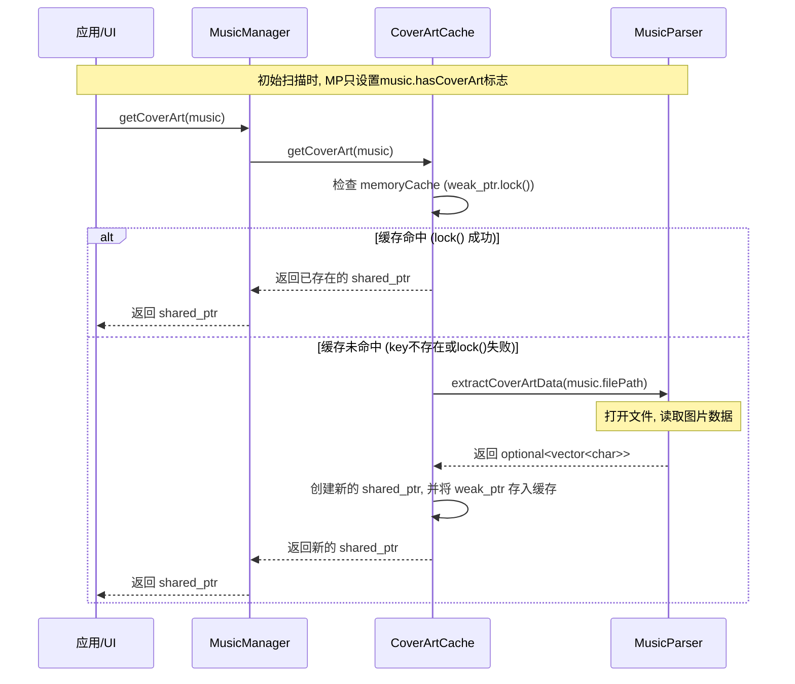

#### 1. 核心思想：延迟加载与内存缓存

为了最大限度地减少内存占用并提高音乐库的初始扫描速度，`MusicEngine` 对专辑图片采用了**“延迟加载 (Lazy Loading)”**与**“按需加载 (On-Demand)”**的核心策略。

整个逻辑的目标是：

- 在初始扫描阶段，不加载任何实际的图片数据到内存中。
- 只有当用户界面（UI）或其他应用逻辑**明确请求**某张图片时，才从音乐文件中提取它。
- 提取一次后，将图片数据**缓存**在内存中，以便后续快速访问。
- 当图片不再被任何部分使用时，其占用的内存将被**自动回收**，防止内存泄漏。

这个流程主要分为三个阶段：音乐扫描、封面获取、缓存与内存管理。

#### 2. 阶段一：音乐扫描 (Music Scanning)
这是整个流程的起点，发生在调用 `MusicManager::startScan()` 时。

- `MusicManager` 会遍历指定的音乐目录，并为每个文件调用 `MusicParser::createMusicFromFile()`。
- 在该函数内部，解析器会打开音乐文件，读取标题、艺术家等基本元数据。
- 对于专辑封面，解析器**仅调用 `checkCoverArtExists()` 函数**。此函数只检查文件中是否存在附加的图片流，并相应地设置 `Music` 结构体中的 `hasCoverArt` 布尔标志位，而**不会读取和存储任何图片数据**。
- 最终，`startScan` 完成后，`MusicManager` 维护的 `m_musicDatabase` 中存储的是一系列“轻量级”的 `Music` 对象，它们不包含任何图片数据，因此内存占用极低。

#### 3. 阶段二：封面获取 (Cover Art Retrieval)

当应用程序需要显示某首歌曲的封面时，封面获取流程被触发。

1. **统一入口**: 应用程序调用 `MusicManager::getCoverArt(music)` 方法作为获取封面的唯一入口。
2. **任务委托**: `MusicManager` 自身不处理这个请求，而是作为一个“门面(Facade)”，将任务直接委托给 `CoverArtCache` 单例，调用 `CoverArtCache::getInstance().getCoverArt(music)`。
3. **缓存检查**: `CoverArtCache` 是处理核心逻辑的地方。
   - 首先，它会检查传入的 `music` 对象的 `hasCoverArt` 标志。如果为 `false`，则直接返回 `nullptr`。
   - 然后，它会以音乐文件的完整路径作为唯一的键（key），在内部的 `memoryCache` (一个 `std::unordered_map`) 中查找。
   - **缓存命中 (Cache Hit)**: 如果找到了对应的 `std::weak_ptr`，并且通过 `lock()` 方法成功地提升为了一个有效的 `std::shared_ptr`，说明图片数据仍在内存中。此时，直接返回这个 `shared_ptr`，流程结束。
   - **缓存未命中 (Cache Miss)**: 如果在 map 中找不到键，或者 `weak_ptr.lock()` 失败（意味着图片数据曾被加载但已被回收），则视为缓存未命中。
4. **按需加载**: 在缓存未命中的情况下，`CoverArtCache` 会调用 `MusicParser::extractCoverArtData(music.filePath)`。这个函数会**重新打开**音乐文件，执行实际的I/O操作，找到封面数据并将其完整地提取到一个 `std::vector<char>` 中返回。
5. **写入缓存**: `extractCoverArtData` 成功返回数据后，`CoverArtCache` 会：
   - 使用返回的数据创建一个 `std::shared_ptr`。
   - 将一个指向该数据的 `std::weak_ptr` 存入 `memoryCache` 中。
   - 将新创建的 `std::shared_ptr` 返回给最初的调用者。

#### 4. 阶段三：缓存与内存管理

本设计的内存管理是全自动的，核心在于 `std::shared_ptr` 和 `std::weak_ptr` 的配合使用。

- **缓存的“弱”持有**: `CoverArtCache` 的 `memoryCache` 中存放的是 `std::weak_ptr`。它是一个“观察者”，不会增加封面数据的引用计数。这意味着，缓存本身**不会阻止**图片数据被销毁。

- **调用者的“强”持有**: `getCoverArt` 方法返回的是一个 `std::shared_ptr` 1。这是一个“拥有者”，只要调用方（如UI组件）还持有这个 

  `shared_ptr`，封面数据的内存就**保证有效**。

- **自动回收**: 当所有持有该封面 `shared_ptr` 的调用者都销毁了它们的指针副本后，引用计数会降为0。此时，封面数据的内存会被**自动释放**。这时，缓存中的 `weak_ptr` 就会“过期”，在下次访问时 `lock()` 会失败，从而触发一次新的“缓存未命中”。

#### 流程图

